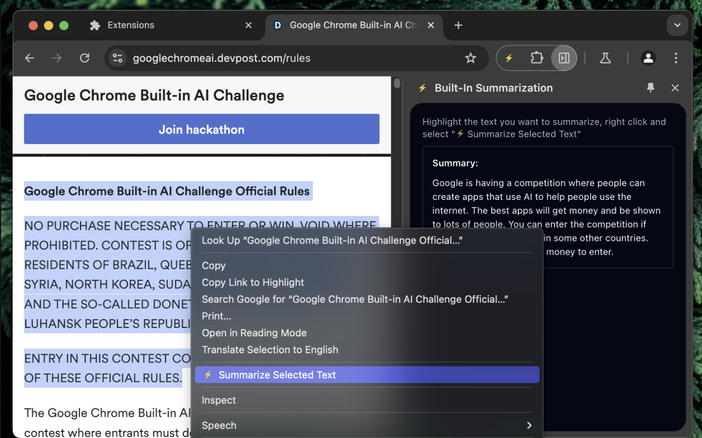
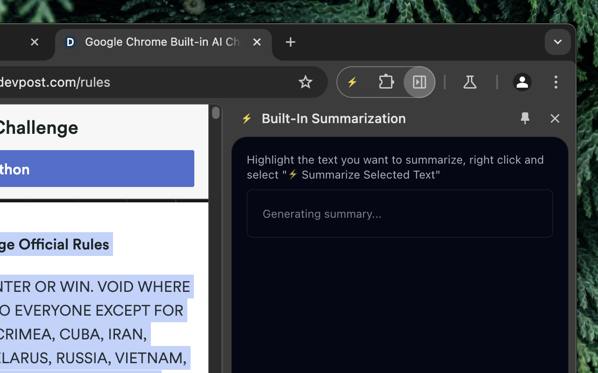

# ⚡ Built-In Summarization ⚡
> [!WARNING]
> Quick project build for [Google Chrome Built-in AI Challenge](https://devpost.com/software/built-in-summarization)

## Inspiration
The overwhelming amount of information online makes it challenging to stay focused and extract key insights. Inspired by the need for speed and simplicity, we envisioned a tool that could summarize any text directly within the browser, saving time and enhancing productivity.

## **What it does**

⚡ Built-In Summarization enables users to highlight any text on a webpage and instantly generate concise, AI-powered summaries. It seamlessly integrates into the Chrome side panel, keeping users engaged without switching tabs or tools.

## **What’s next for ⚡ Built-In Summarization**

- Choices of summarization following the Chrome AI.summarizer API.
- Ability to provide context for better summarization.
